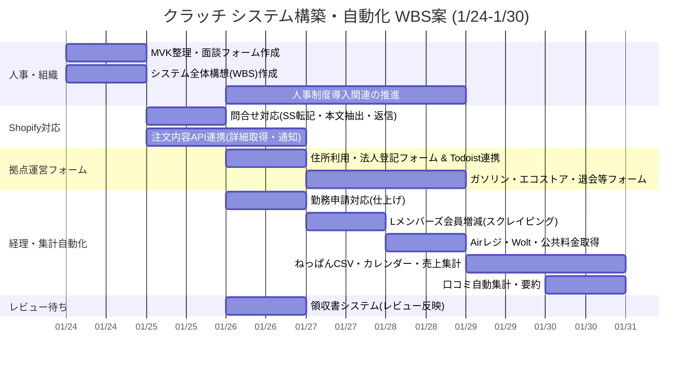
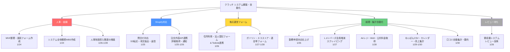
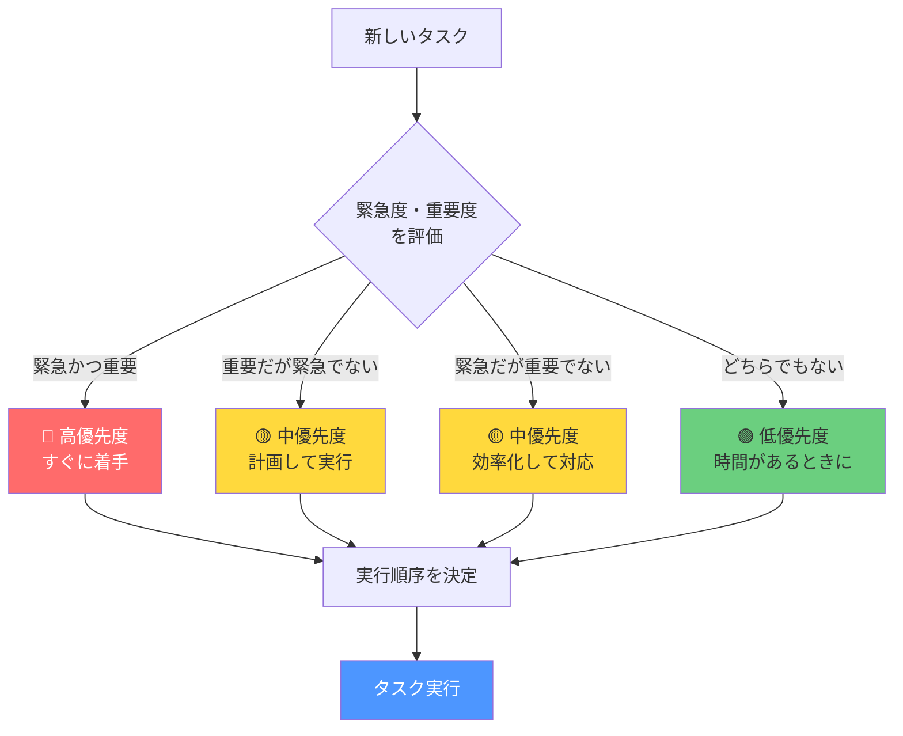

# 📋 タスク整理・思考の整理

## 📅 今週の計画（週次更新）

**週の期間：** 2024年1月24日（水） ～ 2024年1月30日（火）

### 今週の目標
- [ ] クラッチシステム構築・自動化の基盤整備
- [ ] 人事・組織関連の制度導入推進
- [ ] 各種フォーム・API連携の実装

---

## 📊 ガントチャート（週間タスクビュー）

**週の期間：** 2024年1月24日（水） ～ 2024年1月30日（火）

### タスク一覧とガントチャート

| タスク名 | 優先度 | 水<br>1/24 | 木<br>1/25 | 金<br>1/26 | 土<br>1/27 | 日<br>1/28 | 月<br>1/29 | 火<br>1/30 | 進捗 | ステータス |
|---------|--------|:--:|:--:|:--:|:--:|:--:|:--:|:--:|:----:|-----------|
| MVK整理・面談フォーム作成 | 高 | ██ | | | | | | | 0% | 予定 |
| システム全体構想(WBS)作成 | 高 | ██ | | | | | | | 0% | 予定 |
| 問合せ対応(SS転記・本文抽出・返信) | 中 | | ██ | | | | | | 0% | 予定 |
| 注文内容API連携(詳細取得・通知) | 中 | | ██ | ██ | | | | | 0% | 予定 |
| 人事制度導入関連の推進 | 高 | | | ██ | ██ | ██ | | | 0% | 予定 |
| 住所利用・法人登記フォーム & Todoist連携 | 中 | | | ██ | | | | | | 0% | 予定 |
| 勤務申請対応(仕上げ) | 中 | | | ██ | | | | | | 0% | 予定 |
| 領収書システム(レビュー反映) | 中 | | | ██ | | | | | | 0% | 予定 |
| ガソリン・エコストア・退会等フォーム | 中 | | | | ██ | ██ | | | 0% | 予定 |
| Lメンバーズ会員増減(スクレイピング) | 中 | | | | ██ | | | | | 0% | 予定 |
| Airレジ・Wolt・公共料金取得 | 中 | | | | | ██ | | | | 0% | 予定 |
| ねっぱんCSV・カレンダー・売上集計 | 中 | | | | | | ██ | ██ | 0% | 予定 |
| 口コミ自動集計・要約 | 中 | | | | | | | ██ | 0% | 予定 |

**凡例：**
- `██` = タスク実行日
- `░░` = 休み/未実行
- 優先度：高（緊急・重要）、中（重要）、低（その他）

### Mermaidガントチャート（視覚的表示）



### Mermaid WBS（作業分解構造）



### テキスト形式WBS（参考）

```
クラッチ システム構築・自動化
├─ 人事・組織
│  ├─ MVK整理・面談フォーム作成 [1/24]
│  ├─ システム全体構想(WBS)作成 [1/24]
│  └─ 人事制度導入関連の推進 [1/26-1/28]
├─ Shopify対応
│  ├─ 問合せ対応(SS転記・本文抽出・返信) [1/25]
│  └─ 注文内容API連携(詳細取得・通知) [1/25-1/26]
├─ 拠点運営フォーム
│  ├─ 住所利用・法人登記フォーム & Todoist連携 [1/26]
│  └─ ガソリン・エコストア・退会等フォーム [1/27-1/28]
├─ 経理・集計自動化
│  ├─ 勤務申請対応(仕上げ) [1/26]
│  ├─ Lメンバーズ会員増減(スクレイピング) [1/27]
│  ├─ Airレジ・Wolt・公共料金取得 [1/28]
│  ├─ ねっぱんCSV・カレンダー・売上集計 [1/29-1/30]
│  └─ 口コミ自動集計・要約 [1/30]
└─ レビュー待ち
   └─ 領収書システム(レビュー反映) [1/26]
```

### 詳細タスク管理

| No. | タスク名 | 説明 | 開始日 | 期限 | 依存関係 | 備考 |
|-----|---------|------|--------|------|---------|------|
| a1 | MVK整理・面談フォーム作成 | 人事関連のMVK整理と面談フォーム作成 | 1/24 | 1/24 | - | 人事・組織 |
| a2 | システム全体構想(WBS)作成 | システム全体の構想とWBS作成 | 1/24 | 1/24 | - | 人事・組織 |
| a3 | 人事制度導入関連の推進 | 人事制度導入の推進作業 | 1/26 | 1/28 | a1, a2 | 人事・組織 |
| b1 | 問合せ対応(SS転記・本文抽出・返信) | Shopify問合せの自動対応システム | 1/25 | 1/25 | - | Shopify対応 |
| b2 | 注文内容API連携(詳細取得・通知) | 注文内容のAPI連携と通知機能 | 1/25 | 1/26 | b1 | Shopify対応 |
| c1 | 住所利用・法人登記フォーム & Todoist連携 | フォーム作成とTodoist連携 | 1/26 | 1/26 | - | 拠点運営フォーム |
| c2 | ガソリン・エコストア・退会等フォーム | 各種フォーム作成 | 1/27 | 1/28 | c1 | 拠点運営フォーム |
| d1 | 勤務申請対応(仕上げ) | 勤務申請システムの仕上げ | 1/26 | 1/26 | - | 経理・集計自動化 |
| d2 | Lメンバーズ会員増減(スクレイピング) | 会員増減の自動取得 | 1/27 | 1/27 | - | 経理・集計自動化 |
| d3 | Airレジ・Wolt・公共料金取得 | 各種データの自動取得 | 1/28 | 1/28 | - | 経理・集計自動化 |
| d4 | ねっぱんCSV・カレンダー・売上集計 | 売上データの集計 | 1/29 | 1/30 | d3 | 経理・集計自動化 |
| d5 | 口コミ自動集計・要約 | 口コミデータの集計と要約 | 1/30 | 1/30 | - | 経理・集計自動化 |
| e1 | 領収書システム(レビュー反映) | レビュー内容の反映 | 1/26 | 1/26 | - | レビュー待ち |

### Mermaid優先順位決定フローチャート



---

## 💭 思考の整理

### 今週の気づき・学び
- 

### 課題・問題点
- 

### 改善したいこと
- 

### アイデア・メモ
- 

---

## ✅ 完了したタスク

| 完了日 | タスク名 | 所感・学び |
|--------|---------|-----------|
| __/__ | | |
| __/__ | | |

---

## 📝 週次レビュー（翌週初めに記入）

**レビュー期間：** ____年__月__日 ～ ____年__月__日

### 今週の振り返り

#### 達成できたこと
- 

#### 達成できなかったこと・理由
- 

#### 来週への引き継ぎ事項
- 

### 来週の計画

**週の期間：** ____年__月__日 ～ ____年__月__日

#### 来週の目標
- [ ] 
- [ ] 
- [ ] 

#### 来週の重要タスク
- [ ] 
- [ ] 
- [ ] 

---

## 📌 タスク追加・更新ログ

| 日付 | 更新内容 | 詳細 |
|------|---------|------|
| __/__ | タスク追加 | |
| __/__ | タスク完了 | |
| __/__ | タスク更新 | |

---

## 🎯 長期目標・プロジェクト

### 進行中のプロジェクト
- **プロジェクト名：** 
  - 目標：
  - 期限：
  - 進捗：

### 将来の計画
- 

---

## 📚 参考・リソース

- 

---

**最終更新日：** ____年__月__日
