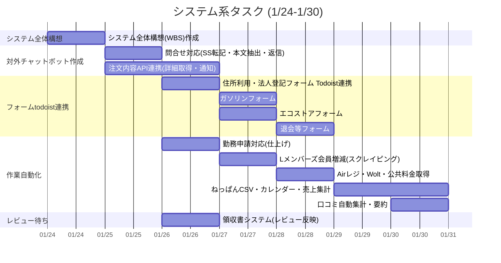
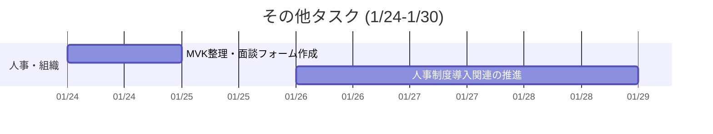
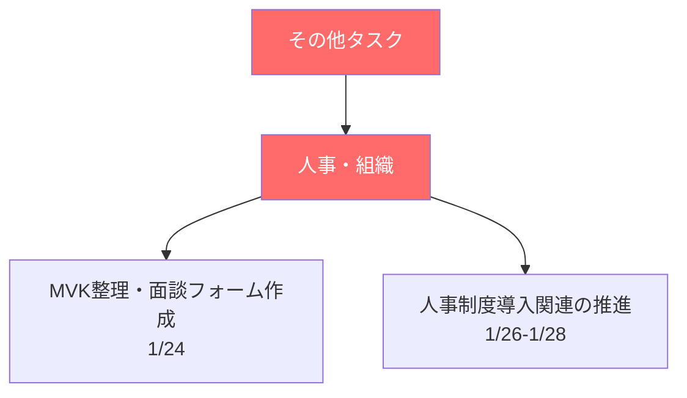
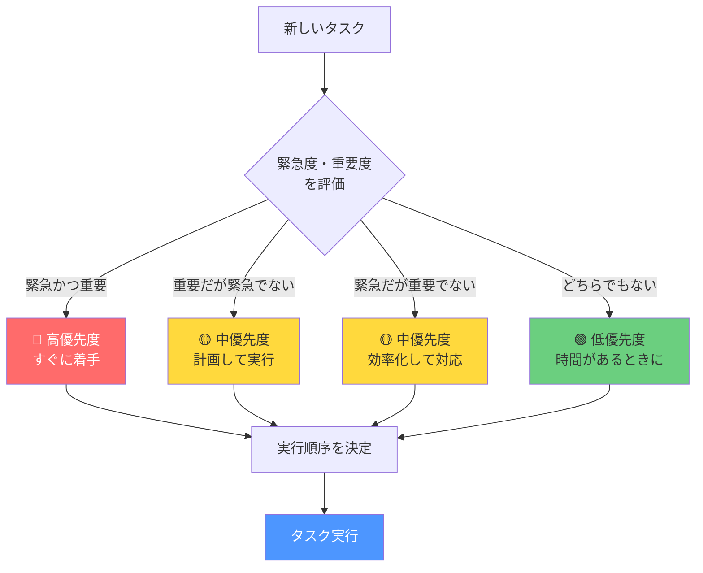

```mermaid
graph TD
    A[システム系タスク] --> B[システム全体構想]
    A --> C[対外チャットボット作成]
    A --> D[フォームtodoist連携]
    A --> E[作業自動化]
    A --> F[レビュー待ち]
    
    B --> B1[システム全体構想WBS作成<br/>1/24]
    B --> B2[社内ポータルの作成<br/>計画中]
    B --> B3[対内チャットボット作成<br/>計画中]
    B --> B4[LINE WORKS移行<br/>計画中]
    
    C --> C1[問合せ対応<br/>SS転記・本文抽出・返信<br/>1/25]
    C --> C2[注文内容API連携<br/>詳細取得・通知<br/>1/25-1/26]
    
    D --> D1[住所利用・法人登記フォーム<br/>Todoist連携<br/>1/26]
    D --> D2[ガソリンフォーム<br/>1/27]
    D --> D3[エコストアフォーム<br/>1/27]
    D --> D4[退会等フォーム<br/>1/28]
    
    E --> E1[勤務申請対応仕上げ<br/>1/26]
    E --> E2[Lメンバーズ会員増減<br/>スクレイピング<br/>1/27]
    E --> E3[Airレジ・Wolt・公共料金取得<br/>1/28]
    E --> E4[ねっぱんCSV・カレンダー・売上集計<br/>1/29-1/30]
    E --> E5[口コミ自動集計・要約<br/>1/30]
    
    F --> F1[領収書システム<br/>レビュー反映<br/>1/26]
    
    style A fill:#4d96ff,color:#fff
    style B fill:#4d96ff,color:#fff
    style C fill:#4d96ff,color:#fff
    style D fill:#4d96ff,color:#fff
    style E fill:#4d96ff,color:#fff
    style F fill:#4d96ff,color:#fff
```

# 📋 タスク整理・思考の整理

## 📅 今週の計画（週次更新）

**週の期間：** 2024年1月24日（水） ～ 2024年1月30日（火）

### 今週の目標
- [ ] クラッチシステム構築・自動化の基盤整備
- [ ] 人事・組織関連の制度導入推進
- [ ] 各種フォーム・API連携の実装

---

## 📊 ガントチャート（週間タスクビュー）

**週の期間：** 2024年1月24日（水） ～ 2024年1月30日（火）

### 🔧 システム系タスク（他メンバーとスケジュール確認が必要）

| カテゴリ | タスク名 | 優先度 | 水<br>1/24 | 木<br>1/25 | 金<br>1/26 | 土<br>1/27 | 日<br>1/28 | 月<br>1/29 | 火<br>1/30 | 進捗 | ステータス |
|---------|---------|--------|:--:|:--:|:--:|:--:|:--:|:--:|:--:|:----:|-----------|
| **システム全体構想** | | | | | | | | | | | |
| | システム全体構想(WBS)作成 | 高 | ██ | | | | | | | 0% | 予定 |
| **対外チャットボット作成** | | | | | | | | | | | |
| | 問合せ対応(SS転記・本文抽出・返信) | 中 | | ██ | | | | | | 0% | 予定 |
| | 注文内容API連携(詳細取得・通知) | 中 | | ██ | ██ | | | | | 0% | 予定 |
| **フォームtodoist連携** | | | | | | | | | | | |
| | 住所利用・法人登記フォーム & Todoist連携 | 中 | | | ██ | | | | | | 0% | 予定 |
| | ガソリンフォーム | 中 | | | | ██ | | | | | 0% | 予定 |
| | エコストアフォーム | 中 | | | | ██ | | | | | 0% | 予定 |
| | 退会等フォーム | 中 | | | | | ██ | | | | 0% | 予定 |
| **作業自動化** | | | | | | | | | | | |
| | 勤務申請対応(仕上げ) | 中 | | | ██ | | | | | | 0% | 予定 |
| | Lメンバーズ会員増減(スクレイピング) | 中 | | | | ██ | | | | | 0% | 予定 |
| | Airレジ・Wolt・公共料金取得 | 中 | | | | | ██ | | | | 0% | 予定 |
| | ねっぱんCSV・カレンダー・売上集計 | 中 | | | | | | ██ | ██ | 0% | 予定 |
| | 口コミ自動集計・要約 | 中 | | | | | | | ██ | 0% | 予定 |
| **レビュー待ち** | | | | | | | | | | | |
| | 領収書システム(レビュー反映) | 中 | | | ██ | | | | | | 0% | 予定 |

<details>
<summary>📊 ガントチャートを表示（クリックで展開）</summary>



</details>

### 📋 その他タスク

| タスク名 | 優先度 | 水<br>1/24 | 木<br>1/25 | 金<br>1/26 | 土<br>1/27 | 日<br>1/28 | 月<br>1/29 | 火<br>1/30 | 進捗 | ステータス |
|---------|--------|:--:|:--:|:--:|:--:|:--:|:--:|:--:|:----:|-----------|
| MVK整理・面談フォーム作成 | 高 | ██ | | | | | | | 0% | 予定 |
| 人事制度導入関連の推進 | 高 | | | ██ | ██ | ██ | | | 0% | 予定 |

**凡例：**
- `██` = タスク実行日
- `░░` = 休み/未実行
- 優先度：高（緊急・重要）、中（重要）、低（その他）
- ⚠️ システム系タスクは他メンバーとスケジュール確認が必要

<details>
<summary>📊 ガントチャートを表示（クリックで展開）</summary>



</details>
---

### システム全体構想（大きなカテゴリ）

システム全体構想は以下の6つの大きなカテゴリで構成されています：

1. **社内ポータルの作成**
   - 社内情報を蓄積するプラットフォーム
   - 水道・ガス・電気の各部屋の番号も含む

2. **対外チャットボット作成**
   - 顧客向けチャットボット
   - （現在のタスク：問合せ対応、注文内容API連携）

3. **対内チャットボット作成**
   - 社内向けチャットボット

4. **LINE WORKS移行**
   - LINE WORKSへの移行作業

5. **フォームtodoist連携**
   - 各種フォームとTodoistの連携
   - （現在のタスク：住所利用・法人登記フォーム、ガソリンフォーム、エコストアフォーム、退会等フォーム）

6. **作業自動化**
   - 各種業務の自動化
   - （現在のタスク：勤務申請対応、Lメンバーズ会員増減、Airレジ・Wolt・公共料金取得、ねっぱんCSV・カレンダー・売上集計、口コミ自動集計・要約）

> 💡 **注意**: 各カテゴリの詳細なタスクは対話しながら追加していきます。

### Mermaid WBS（作業分解構造）

#### 🔧 システム系タスク

<details>
<summary>📊 WBS図を表示（クリックで展開）</summary>



</details>

#### 📋 その他タスク

<details>
<summary>📊 WBS図を表示（クリックで展開）</summary>



</details>

### テキスト形式WBS（参考）

<details>
<summary>📋 テキスト形式WBSを表示（クリックで展開）</summary>

#### 🔧 システム系タスク

```
システム系タスク
├─ システム全体構想
│  ├─ システム全体構想(WBS)作成 [1/24]
│  ├─ 社内ポータルの作成 [計画中]
│  ├─ 対内チャットボット作成 [計画中]
│  └─ LINE WORKS移行 [計画中]
├─ 対外チャットボット作成
│  ├─ 問合せ対応(SS転記・本文抽出・返信) [1/25]
│  └─ 注文内容API連携(詳細取得・通知) [1/25-1/26]
├─ フォームtodoist連携
│  ├─ 住所利用・法人登記フォーム & Todoist連携 [1/26]
│  ├─ ガソリンフォーム [1/27]
│  ├─ エコストアフォーム [1/27]
│  └─ 退会等フォーム [1/28]
├─ 作業自動化
│  ├─ 勤務申請対応(仕上げ) [1/26]
│  ├─ Lメンバーズ会員増減(スクレイピング) [1/27]
│  ├─ Airレジ・Wolt・公共料金取得 [1/28]
│  ├─ ねっぱんCSV・カレンダー・売上集計 [1/29-1/30]
│  └─ 口コミ自動集計・要約 [1/30]
└─ レビュー待ち
   └─ 領収書システム(レビュー反映) [1/26]
```

#### 📋 その他タスク

```
その他タスク
└─ 人事・組織
   ├─ MVK整理・面談フォーム作成 [1/24]
   └─ 人事制度導入関連の推進 [1/26-1/28]
```

</details>

### 詳細タスク管理

#### 🔧 システム系タスク（他メンバーとスケジュール確認が必要）

| No. | タスク名 | 説明 | 開始日 | 期限 | 依存関係 | カテゴリ |
|-----|---------|------|--------|------|---------|---------|
| a2 | システム全体構想(WBS)作成 | システム全体の構想とWBS作成 | 1/24 | 1/24 | - | システム全体構想 |
| b1 | 問合せ対応(SS転記・本文抽出・返信) | Shopify問合せの自動対応システム | 1/25 | 1/25 | - | 対外チャットボット作成 |
| b2 | 注文内容API連携(詳細取得・通知) | 注文内容のAPI連携と通知機能 | 1/25 | 1/26 | b1 | 対外チャットボット作成 |
| c1 | 住所利用・法人登記フォーム & Todoist連携 | フォーム作成とTodoist連携 | 1/26 | 1/26 | - | フォームtodoist連携 |
| c21 | ガソリンフォーム | ガソリンフォーム作成 | 1/27 | 1/27 | c1 | フォームtodoist連携 |
| c22 | エコストアフォーム | エコストアフォーム作成 | 1/27 | 1/27 | c1 | フォームtodoist連携 |
| c23 | 退会等フォーム | 退会等フォーム作成 | 1/28 | 1/28 | c1 | フォームtodoist連携 |
| d1 | 勤務申請対応(仕上げ) | 勤務申請システムの仕上げ | 1/26 | 1/26 | - | 作業自動化 |
| d2 | Lメンバーズ会員増減(スクレイピング) | 会員増減の自動取得 | 1/27 | 1/27 | - | 作業自動化 |
| d3 | Airレジ・Wolt・公共料金取得 | 各種データの自動取得 | 1/28 | 1/28 | - | 作業自動化 |
| d4 | ねっぱんCSV・カレンダー・売上集計 | 売上データの集計 | 1/29 | 1/30 | d3 | 作業自動化 |
| d5 | 口コミ自動集計・要約 | 口コミデータの集計と要約 | 1/30 | 1/30 | - | 作業自動化 |
| e1 | 領収書システム(レビュー反映) | レビュー内容の反映 | 1/26 | 1/26 | - | レビュー待ち |

#### 📋 その他タスク

| No. | タスク名 | 説明 | 開始日 | 期限 | 依存関係 | 備考 |
|-----|---------|------|--------|------|---------|------|
| a1 | MVK整理・面談フォーム作成 | 人事関連のMVK整理と面談フォーム作成 | 1/24 | 1/24 | - | 人事・組織 |
| a3 | 人事制度導入関連の推進 | 人事制度導入の推進作業 | 1/26 | 1/28 | a1 | 人事・組織 |

### Mermaid優先順位決定フローチャート

<details>
<summary>📊 優先順位決定フローチャートを表示（クリックで展開）</summary>



</details>

---

## 💭 思考の整理

### 今週の気づき・学び
- 

### 課題・問題点
- 

### 改善したいこと
- 

### アイデア・メモ
- **社内ポータル構築**: 社内情報を蓄積するプラットフォームを作成。社内情報には水道・ガス・電気の各部屋の番号も含める必要がある
- **タスク分類ルール**: 今後タスクを追加する際は、システム系かそれ以外かを必ず分類すること。システム系タスクは他メンバーとスケジュール確認が必要なため、ガントチャートも分けて管理する
- **システム全体構想の6大カテゴリ**: 
  1. 社内ポータルの作成
  2. 対外チャットボット作成
  3. 対内チャットボット作成
  4. LINE WORKS移行
  5. フォームtodoist連携
  6. 作業自動化
  - 各カテゴリの詳細タスクは対話しながら追加していく

---

## ✅ 完了したタスク

| 完了日 | タスク名 | 所感・学び |
|--------|---------|-----------|
| __/__ | | |
| __/__ | | |

---

## 📝 週次レビュー（翌週初めに記入）

**レビュー期間：** ____年__月__日 ～ ____年__月__日

### 今週の振り返り

#### 達成できたこと
- 

#### 達成できなかったこと・理由
- 

#### 来週への引き継ぎ事項
- 

### 来週の計画

**週の期間：** ____年__月__日 ～ ____年__月__日

#### 来週の目標
- [ ] 
- [ ] 
- [ ] 

#### 来週の重要タスク
- [ ] 
- [ ] 
- [ ] 

---

## 📌 タスク追加・更新ログ

| 日付 | 更新内容 | 詳細 |
|------|---------|------|
| 2024/01/22 | タスク追加 | 社内ポータル構築プロジェクト（社内情報蓄積プラットフォーム、水道・ガス・電気の各部屋番号含む） |
| 2024/01/22 | タスク分類 | タスクを「システム系」と「それ以外」に分類。システム系は他メンバーとスケジュール確認が必要。ガソリン・エコストア・退会等フォームを個別タスクに分割 |
| 2024/01/22 | システム全体構想更新 | システム全体構想を6つの大きなカテゴリ（社内ポータル、対外チャットボット、対内チャットボット、LINE WORKS移行、フォームtodoist連携、作業自動化）に分類。既存タスクを適切なカテゴリに分類し直し |
| __/__ | タスク完了 | |
| __/__ | タスク更新 | |

---

## 🎯 長期目標・プロジェクト

### 進行中のプロジェクト
- **プロジェクト名：** 社内ポータル構築
  - 目標：社内情報を蓄積するためのプラットフォームを作成
  - 期限：未定
  - 進捗：計画中
  - 詳細：
    - 社内情報を蓄積するプラットフォームの構築
    - 社内情報の登録・管理機能
    - **重要**: 水道・ガス・電気の各部屋の番号も含める必要がある

### 将来の計画
- 社内ポータル構築プロジェクトの詳細設計

---

## 📚 参考・リソース

- 

---

**最終更新日：** ____年__月__日
