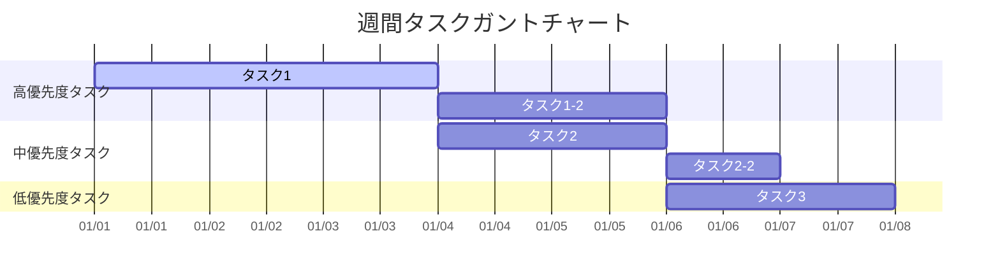
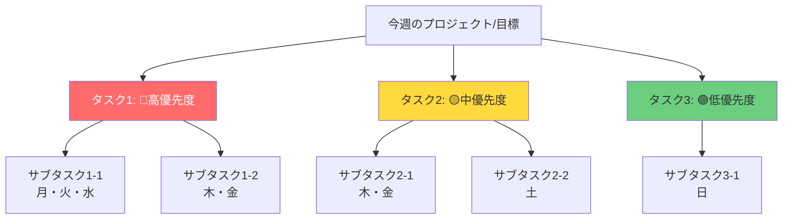

# 📋 週次タスク整理・思考の整理

**週の期間：** ____年__月__日（月） ～ ____年__月__日（日）  
**作成日：** ____年__月__日

---

## 🎯 今週の目標

- [ ] 
- [ ] 
- [ ] 

---

## 📊 ガントチャート（週間タスクビュー）

### タスク一覧とガントチャート

| タスク名 | 優先度 | 月<br>__/__ | 火<br>__/__ | 水<br>__/__ | 木<br>__/__ | 金<br>__/__ | 土<br>__/__ | 日<br>__/__ | 進捗 | ステータス |
|---------|--------|:--:|:--:|:--:|:--:|:--:|:--:|:--:|:----:|-----------|
| | | | | | | | | | | |
| | | | | | | | | | | |
| | | | | | | | | | | |

**凡例：**
- `███` = タスク実行日（実際に作業する日）
- `░░░` = 休み/未実行
- `▶▶▶` = 継続タスク（複数週にまたがる）
- 優先度：🔴高（緊急・重要）、🟡中（重要）、🟢低（その他）

### Mermaidガントチャート（視覚的表示）



**使い方：**
- `dateFormat` と日付を実際の週の日付に変更してください
- `section` で優先度ごとにグループ化
- `active` で現在進行中のタスクを強調
- `after task1` で依存関係を表現

### Mermaid WBS（作業分解構造）



### テキスト形式WBS（参考）

```
今週のプロジェクト/目標
├─ タスク1（優先度：🔴）
│  ├─ サブタスク1-1 [月][火][水]
│  └─ サブタスク1-2 [木][金]
├─ タスク2（優先度：🟡）
│  ├─ サブタスク2-1 [木][金]
│  └─ サブタスク2-2 [土]
└─ タスク3（優先度：🟢）
   └─ サブタスク3-1 [日]
```

### 詳細タスク管理

| No. | タスク名 | 説明 | 開始日 | 期限 | 依存関係 | 備考 |
|-----|---------|------|--------|------|---------|------|
| 1 | | | __/__ | __/__ | | |
| 2 | | | __/__ | __/__ | | |
| 3 | | | __/__ | __/__ | | |

---

## 📅 日別タスク詳細

### 月曜日（__/__）
- [ ] 
- [ ] 

### 火曜日（__/__）
- [ ] 
- [ ] 

### 水曜日（__/__）
- [ ] 
- [ ] 

### 木曜日（__/__）
- [ ] 
- [ ] 

### 金曜日（__/__）
- [ ] 
- [ ] 

### 土曜日（__/__）
- [ ] 
- [ ] 

### 日曜日（__/__）
- [ ] 
- [ ] 

---

## 💭 思考の整理

### 今週の気づき・学び
- 

### 課題・問題点
- 

### 改善したいこと
- 

### アイデア・メモ
- 

---

## ✅ 完了したタスク

| 完了日 | タスク名 | 所感・学び | 所要時間 |
|--------|---------|-----------|---------|
| __/__ | | | |
| __/__ | | | |

---

## 📌 タスク追加・更新ログ

| 日付 | 時刻 | 更新内容 | 詳細 |
|------|------|---------|------|
| __/__ | __:__ | タスク追加 | |
| __/__ | __:__ | タスク完了 | |
| __/__ | __:__ | タスク更新 | |

---

## 📝 週次レビュー（週末/翌週初めに記入）

### 今週の振り返り

#### 達成できたこと
- 

#### 達成できなかったこと・理由
- 

#### 来週への引き継ぎ事項
- 

#### 今週の時間配分
- タスク1：約__時間
- タスク2：約__時間
- その他：約__時間

### 来週の計画（プレビュー）

**週の期間：** ____年__月__日（月） ～ ____年__月__日（日）

#### 来週の目標
- [ ] 
- [ ] 
- [ ] 

#### 来週の重要タスク
- [ ] 
- [ ] 
- [ ] 

---

**最終更新日：** ____年__月__日
